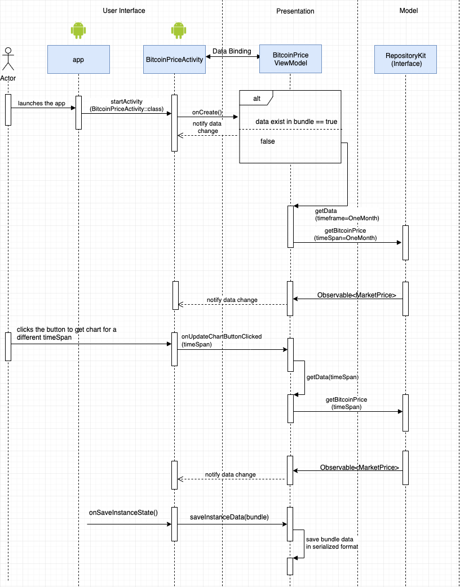
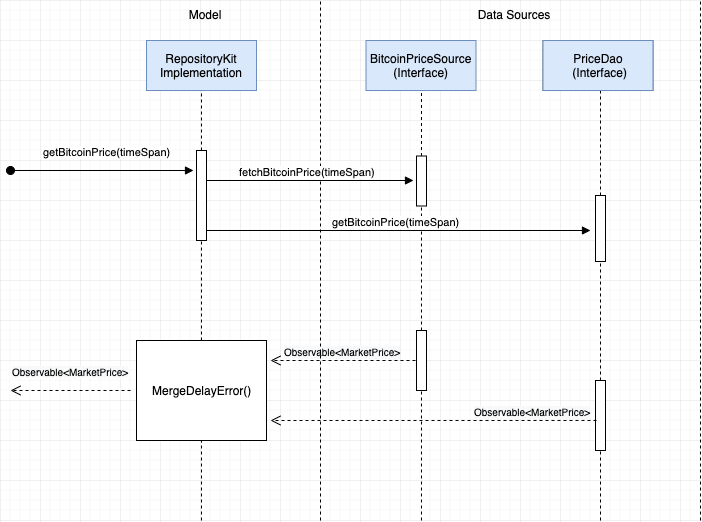
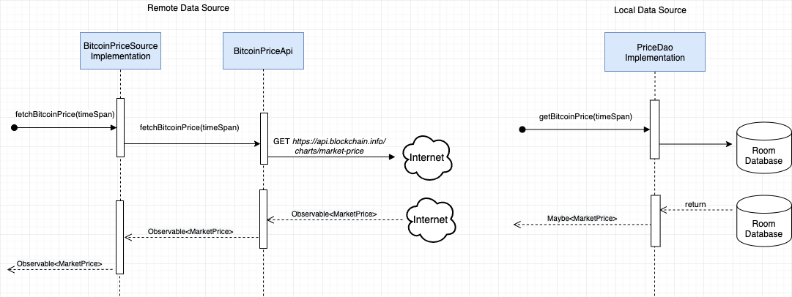

# Android App To Demonstrate Clean Architecture
Android app to demonstrate Clean Architecture. The application uses Clean Architecture based on MVVM and Repository patterns. The application is written entirely in Kotlin.

The application does network HTTP requests via Retrofit, OkHttp and GSON. Loaded data is saved to SQL based database Room, which serves as single source of truth and support offline mode.

Dagger 2 is used for dependency injection.

Unit tests are written using JUnit and Mockito.

## Languages, libraries and tools used

* [Kotlin](https://kotlinlang.org/)
* [Room](https://developer.android.com/topic/libraries/architecture/room.html)
* [Android Architecture Components](https://developer.android.com/topic/libraries/architecture/index.html)
* Android Support Libraries
* [RxJava2](https://github.com/ReactiveX/RxJava/wiki/What's-different-in-2.0)
* [Dagger 2](https://github.com/google/dagger)
* [Retrofit](http://square.github.io/retrofit/)
* [OkHttp](http://square.github.io/okhttp/)
* [Gson](https://github.com/google/gson)
* [Mockito](http://site.mockito.org/)

## Architecture

The architecture of the project follows the principles of Clean Architecture. Here's how the sample project implements it:
 
 

 
 

 
 

## App Demo
User can select various timespan to see the Bitcoin price 
